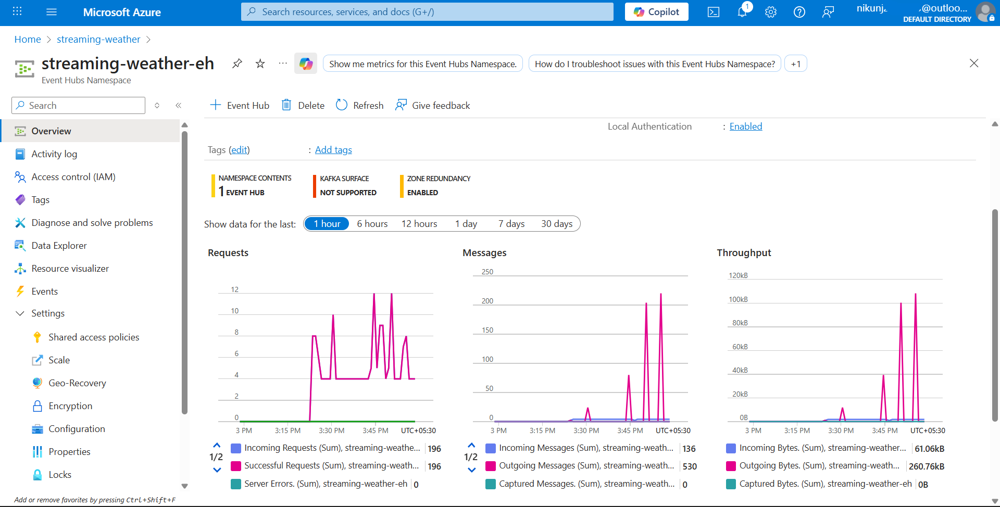
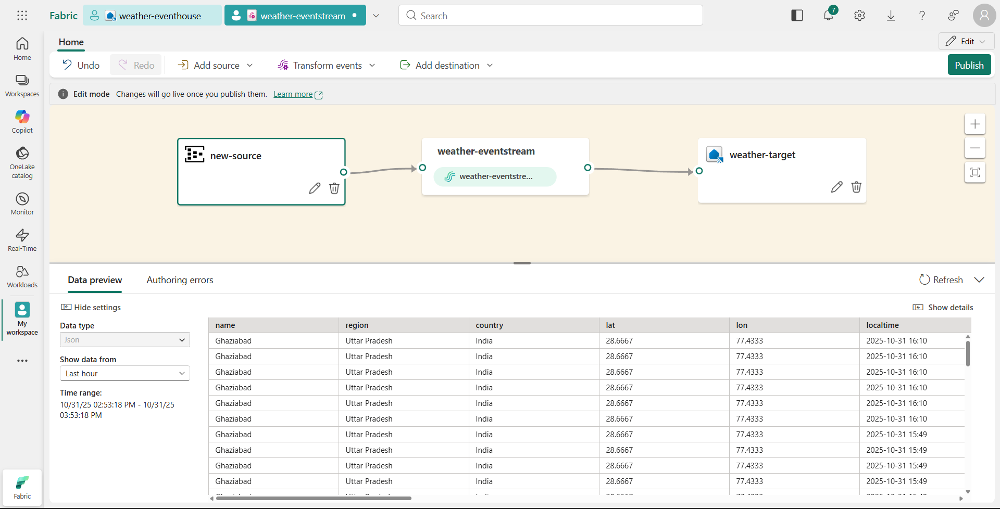
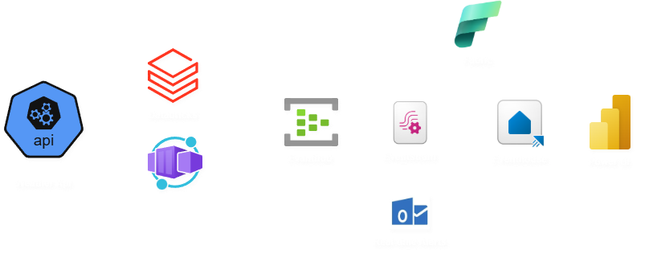

# 🌦️ Real-Time Weather Data Streaming Pipeline on Azure


## 🧭 Project Overview

This project demonstrates a real-time weather data streaming pipeline built on Microsoft Azure.
It continuously fetches live weather data from an external API, streams it into Azure Event Hub, processes it using Databricks, and visualizes actionable insights through Power BI dashboards.

The pipeline ensures secure secret management using Azure Key Vault and enables intelligent alerting through Microsoft Fabric’s Real-Time Eventhouse and Alert system.


## 🧱 Architecture
Weather API 
    ↓
Azure Container App (Python Streamer)
    ↓
Azure Event Hub
    ↓
Microsoft Fabric Eventstream
    ↓
Fabric Eventhouse (KQL DB)
    ↓
Power BI Dashboard
    ↓
Fabric Alerts / Email Notifications


Security Layer: Azure Key Vault manages credentials (API key, Event Hub connection).
Processing Layer: Azure Databricks performs advanced transformations on ingested weather data.
Visualization Layer: Power BI provides live analytics and real-time dashboards.

## ⚙️ Tech Stack
|Category |	Technology |
|-----------|---------------|
|Language|	Python|
|Stream Ingestion|	☁️Azure Event Hub|
|Data Processing|	🧱Azure Databricks|
|Secret Management|	🔐Azure Key Vault|
|Streaming & Storage	Microsoft| 💼Fabric Eventstream + Eventhouse|
|Visualization| 📊	Power BI|
|Notification|	🧠Fabric Alerts|
|Containerization|	🐳Azure Container Apps|

## 📂 Project Structure
```bash
Real-Time-Weather-Data-Pipeline/
| 
├── src/
│   ├── container-app/
│   │   ├── app.py
│   │   ├── Dockerfile
│   │   └── requirements.txt
│   ├── databricks/
│   │   ├── data_transformation.py
│   │   └── streaming_notebook.py
│   └── utils/
│       └── flatten_json.py
│
├── architecture/
│   ├── flow-diagram.drawio
│   └── flow-diagram.png
│
├── sample-data/
│   ├── raw_weather_data.json
│   ├── processed_event_data.json
│   └── transformed_output.json
│
├── screenshots/
│   ├── eventhub_metrics.png
│   ├── eventstream_fabric.png
│   ├── powerbi_dashboard.png
│   └── fabric_alert.png
│
├── .gitignore
└── README.md
```
## 🚀 Pipeline Flow
```bash
1️⃣ Weather API Data Extraction — The Container App fetches real-time weather metrics (temperature, humidity, air quality, alerts).
2️⃣ Streaming to Event Hub — Data is pushed to Event Hub in flattened JSON format.
3️⃣ Transformation in Databricks — Cleans, validates, and enriches weather data.
4️⃣ Fabric Eventstream — Streams and routes processed data to Eventhouse.
5️⃣ Fabric Eventhouse (KQL DB) — Stores real-time data for queries and analysis.
6️⃣ Power BI Dashboard — Displays live metrics and trends.
7️⃣ Fabric Alerts — Automatically triggers notifications for severe weather conditions.
```
## 📊 Key Features

⚡ Real-time ingestion using Azure Event Hub

🧠 Stream processing with Microsoft Fabric Eventstream

🔒 Secure API management with Azure Key Vault

🔄 Continuous transformation using Databricks notebooks

📈 Dynamic Power BI dashboards for visualization

📬 Smart alert system for live event notifications

## 🧪 Sample JSON (Processed Data)
```bash
{
  "city": "Ghaziabad",
  "temperature_celsius": 26.5,
  "humidity": 65,
  "condition": "Partly Cloudy",
  "wind_speed_kph": 3.6,
  "timestamp": "2025-11-02 12:45:00Z"
}
```

## 🔐 Secrets & Environment Setup

Create a .env file (not uploaded to GitHub):

EVENT_HUB_CONN_STR=<your_eventhub_connection_string>
EVENT_HUB_NAME=streamingweathereventhub
KEY_VAULT_URL=https://streaming-weather-kv.vault.azure.net/
WEATHER_API_KEY=<your_api_key>


All secrets are securely managed by Azure Key Vault in the actual deployment.

## 📸 Screenshots
### 🌀 Event Hub
	
### 🌊 Eventstream
	
### 📊 Power BI Dashboard

### 🖼️ Architecture Diagram

	
	
## 🚀 Quick Start
### 1. Clone Repository
git clone https://github.com/Nikunj2311/Real-Time-Weather-Data-Pipeline.git
cd Real-Time-Weather-Data-Pipeline

### 2. Build Docker Image
docker build -t weather-pipeline:latest ./src/container-app

### 3. Run Locally
docker run --env-file .env weather-pipeline:latest

## 💡 Future Enhancements

* Integrate ML-based weather forecasting

* Add data quality validation layer in Databricks

* Implement CI/CD with GitHub Actions for automation

* Extend Fabric Alerts to Slack & Teams notifications

* Deploy dashboard to Power BI Service with live refresh

## 🧠 Project Learnings & Challenges

- Learned how to connect Azure Container Apps securely with Event Hub and Key Vault.  
- Understood how **region availability and subscription type** affect deployment (e.g., Function App was restricted in student plan).  
- Explored **cost optimization** by using Container Apps more than databricks.  
- Implemented secure API key handling using Azure Key Vault and Managed Identity.


## 👨‍💻 Author

|Developed by: Nikunj Bansal|

📧 Email: nikunjb832@example.com

[](https://www.linkedin.com/in/nikunj-bansal-166555347/)

[](https://github.com/Nikunj2311)


## 🏁 Summary

This project represents a complete real-time data engineering workflow integrating multiple Azure components to stream, transform, and visualize live weather data.
It demonstrates end-to-end data flow automation, secure configuration management, and modern real-time analytics using Microsoft Fabric and Power BI.
